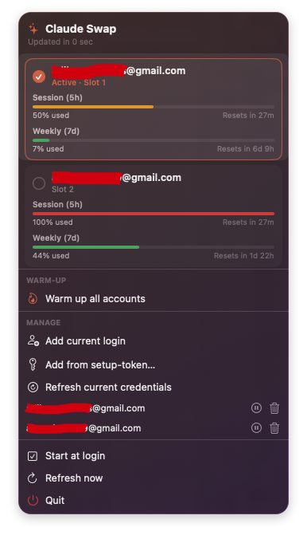

# CSwapBar

A native macOS menu bar app for [claude-swap](https://github.com/realiti4/claude-swap) — see every managed Claude Code account's 5-hour and weekly usage at a glance, and switch between them with one click.

It owns no account-switching logic of its own. Every action shells out to the real `cswap` CLI, so the two stay in sync.



## Install

```sh
brew install --cask ahmadarif-lab/tap/cswapbar
```

Requires the `cswap` CLI itself, which is not a Homebrew package:

```sh
uv tool install claude-swap     # or: pipx install claude-swap
```

It starts itself at login from the first launch onwards (via `SMAppService`). Turn that off from **Start at login** in the menu, or in System Settings → General → Login Items.

## What it does

- Usage bars per account (5h session + 7d weekly), color-coded by how much is left
- Mini usage bars in the menu bar itself, so you don't have to open the popover
- Click any account card to switch to it
- **Warm up all accounts** — rotates through every account, sends a throwaway `claude -p` to each, then returns to the account you started on
- Add an account from the current login or from a setup-token; pause/resume and remove accounts
- Shows its version in the header; when a newer release is out, **Install update** installs it with Homebrew and relaunches

Every row maps to a real command:

| UI | Command |
| --- | --- |
| Account cards, usage bars | `cswap list --json` |
| Click a card | `cswap switch <n>` |
| Add current login / Refresh credentials | `cswap add` |
| Add from setup-token | `cswap add-token <token> [--email …]` |
| Pause / resume | `cswap disable` / `cswap enable` |
| Remove | `cswap remove <n>` |
| Warm up all accounts | `cswap switch <n>` + `claude -p` per account |
| Check for updates | GitHub's latest-release API, every 6 hours and on click |
| Install update | `brew update` + `brew upgrade --cask ahmadarif-lab/tap/cswapbar`, then a relaunch |

## Build from source

Requires macOS 14+ and a Swift 5.10+ toolchain.

```sh
swift run                        # dev build (shows a temporary Dock icon)
./Scripts/build_app.sh           # packages dist/CSwapBar.app
./Scripts/package_release.sh     # also builds the DMG and prints its sha256
```

To reload a rebuilt app:

```sh
killall CSwapBar; open /Applications/CSwapBar.app
```

## License

MIT
