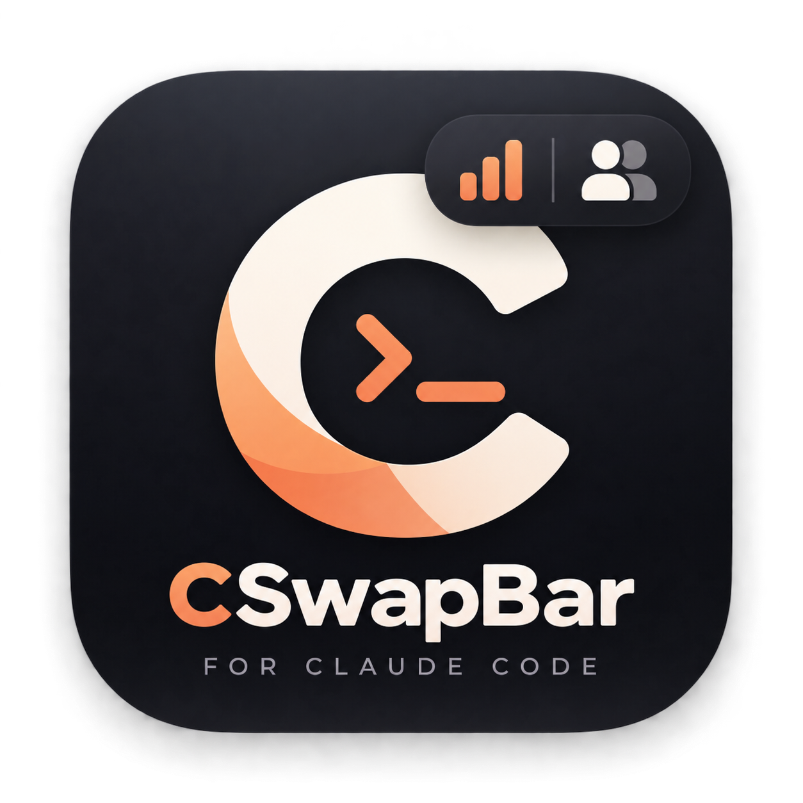
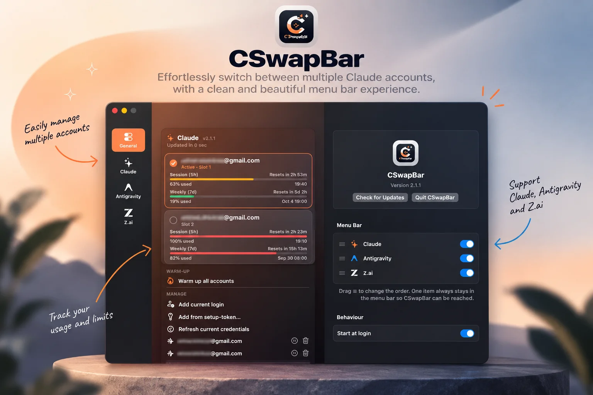

<p align="center">
  
</p>

<h1 align="center">CSwapBar</h1>

<p align="center">
  A native macOS menu bar app that tracks quota across several AI coding tools at once — Claude Code,
  Antigravity, z.ai, DeepSeek, and OpenCode Go — each as its own menu bar icon you can show or hide from Settings.<br>
  For Claude, it also juggles several accounts: see every account's 5-hour and weekly usage at a
  glance, and switch between them with one click.<br>
  Claude's account engine is a Swift port of <a href="https://github.com/realiti4/claude-swap">claude-swap</a>
  that reads and writes the same data, so the <code>cswap</code> CLI keeps working alongside it — but
  you don't need it installed.
</p>

<p align="center">
  <a href="#install">
    
  </a>
  <a href="https://github.com/ahmadarif-lab/cswapbar/releases/latest">
    
  </a>
</p>

## Install

> [!TIP]
> **Homebrew is the easiest way — one command, nothing else to set up:**
>
> ```sh
> brew install --cask ahmadarif-lab/tap/cswapbar
> ```
>
> It adds the `ahmadarif-lab/tap` tap and clears the quarantine flag, so the app opens straight
> away — no Gatekeeper warning to click through. Then open **CSwapBar** from Applications.

Nothing else is required. Accounts you already manage with claude-swap show up on first launch:
CSwapBar uses the same `~/.claude-swap-backup` folder and Keychain items.

CSwapBar starts itself at login from that first launch onwards (via `SMAppService`). Turn that off
from **Start at login** in the menu, or in System Settings → General → Login Items.

### Updating

CSwapBar checks for a new release when it launches and every six hours after that, and shows
**Install update** in the menu when one is out. Click it: a Homebrew install is upgraded in place
and the app relaunches on its own. A copy that wasn't installed via Homebrew opens the release page
instead.

Or from the terminal:

```sh
brew upgrade --cask cswapbar
```

### Manual install (DMG)

Download `CSwapBar.dmg` from [Releases](https://github.com/ahmadarif-lab/cswapbar/releases/latest)
and drag the app into `Applications`. The Homebrew install clears this for you; here you do it by
hand, since the app is ad-hoc signed rather than signed with a Developer ID and notarized:

```sh
xattr -dr com.apple.quarantine /Applications/CSwapBar.app
```

Or open it once through **System Settings → Privacy & Security**, where an **Open Anyway** button
appears after a blocked launch.

## Screenshot

<p align="center">
  
</p>

## What it does

- Usage bars per account (5h session + 7d weekly), color-coded by how much is left, with the reset
  countdown and local reset time next to each bar
- Mini usage bars in the menu bar itself, so you don't have to open the popover
- Click any account card to switch to it
- **Warm up all accounts** — rotates through every account, sends a throwaway `claude -p` to each,
  then returns to the account you started on; can also run on a schedule (see [Providers](#providers))
- Add an account from the current login or from a setup-token; pause/resume and remove accounts
- Keeps itself up to date: checks for new releases, and a Homebrew install updates in place

Each action does exactly what the matching `cswap` command does, on the same files:

| UI | Same as |
| --- | --- |
| Account cards, usage bars | `cswap list --json` |
| Click a card | `cswap switch <n>` |
| Add current login / Refresh credentials | `cswap add` |
| Add from setup-token | `cswap add-token <token> [--email …]` |
| Pause / resume | `cswap disable` / `cswap enable` |
| Remove | `cswap remove <n>` |
| Warm up all accounts | a switch + `claude -p` per account |
| Check for updates | GitHub's latest-release API, every 6 hours and on click |
| Install update | `brew update` + `brew upgrade --cask ahmadarif-lab/tap/cswapbar`, then a relaunch |

## Providers

Each provider you turn on in **Settings** gets its own menu bar icon and dropdown, showing 5-hour
and weekly (or equivalent) usage bars. Drag to reorder them, or turn any of them off — with every
provider off, a single CSwapBar icon stays in the menu bar for Settings and Quit.

Every provider with a usage window also has a **warm-up**: a short throwaway message that starts its 5-hour window
counting. Run it from the dropdown, or set one or more times of day (24-hour) in that provider's
Settings page to run it on a schedule while CSwapBar is open. (OpenCode Go is the exception: its
quota is read-only.)

| Provider | Quota shown | Connecting |
| --- | --- | --- |
| **Claude Code** | 5h + weekly, per account | on by default; same accounts as above |
| **Antigravity** | 5h + weekly, for both its Gemini pool and its Claude/GPT pool | needs the `agy` CLI, signed in — see [setup](#antigravity-setup) below |
| **z.ai** (GLM Coding Plan) | 5h + weekly | paste an API key from z.ai's own Settings → API keys page |
| **DeepSeek** | remaining API credit (paid + granted) — pay-as-you-go, so no windows or warm-up | paste an API key from platform.deepseek.com → API keys |
| **OpenCode Go** | 5-hour + weekly + monthly subscription quota, with the spend behind each window | just run `opencode auth login opencode` once — CSwapBar reads the credentials OpenCode itself stores (`opencode.db`, or a v1-era `auth.json`), so there's nothing to set up here |

### Antigravity setup

CSwapBar has no login of its own for Antigravity — it relies on the Antigravity CLI:

1. Install the [Antigravity CLI](https://antigravity.google/download#antigravity-cli) (`agy`).
2. Run `agy` once and sign in with your Google account.
3. Turn on the **Antigravity** icon in CSwapBar's Settings.

CSwapBar starts `agy`'s background hub itself and reads quota straight from it, and Antigravity's
warm-up sends its messages through `agy -p` — so `agy` only has to be installed and signed in,
not left running.

## Requirements

- macOS 14 (Sonoma) or later
- Claude Code — the `claude` CLI is only needed for Claude's warm-up
- The [Antigravity CLI](https://antigravity.google/download#antigravity-cli) (`agy`), signed in —
  only for the Antigravity provider
- An OpenCode Go subscription signed in once with `opencode auth login opencode` — only for the
  OpenCode Go provider; CSwapBar reads the credentials OpenCode stores, and needs no CLI of its own
- Xcode command line tools with Swift 5.10+, only if you build from source

## Build from source

```sh
swift run                        # dev build (shows a temporary Dock icon)
swift test                       # account engine tests
./Scripts/build_app.sh           # packages dist/CSwapBar.app
./Scripts/package_release.sh     # also builds the DMG and prints its sha256
```

To reload a rebuilt app:

```sh
killall CSwapBar; open /Applications/CSwapBar.app
```

## Relationship to claude-swap

`Sources/SwapEngine` ports claude-swap 0.26.0's `list`, `switch`, `add`, `add-token`,
`enable`/`disable` and `remove`, keeping its on-disk format byte for byte: `~/.claude-swap-backup`,
the `claude-swap` Keychain service, and Claude Code's own credential and lock files. When a new
claude-swap release changes any of those paths, port the change and bump
`AccountEngine.upstreamVersion`.

## License

MIT
